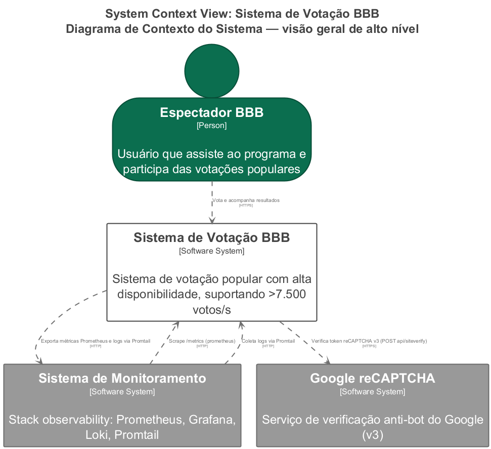
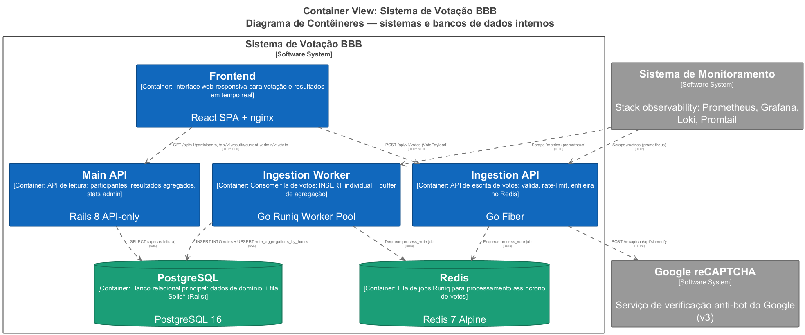
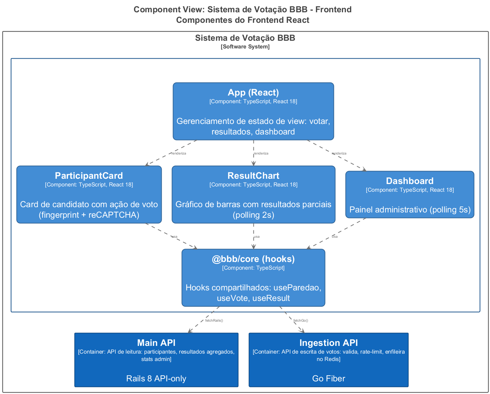
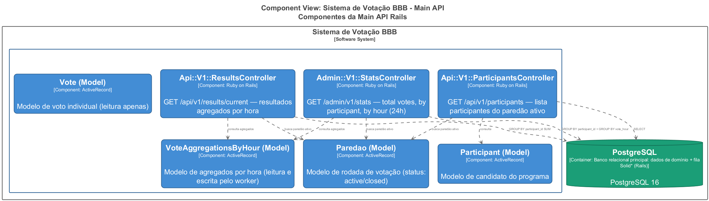
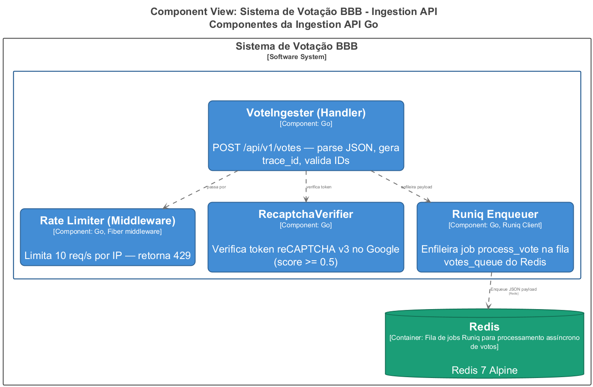
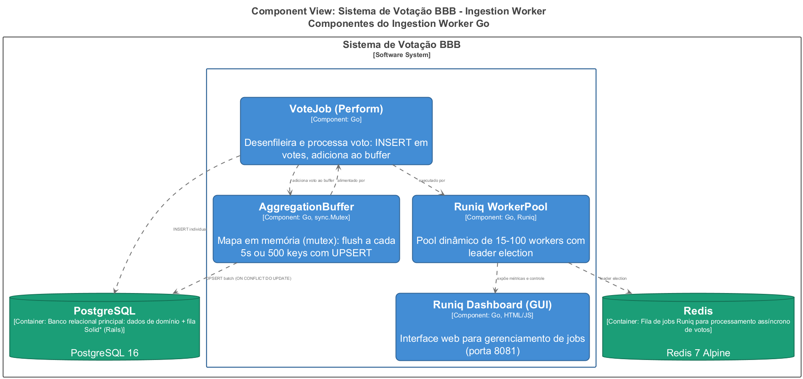
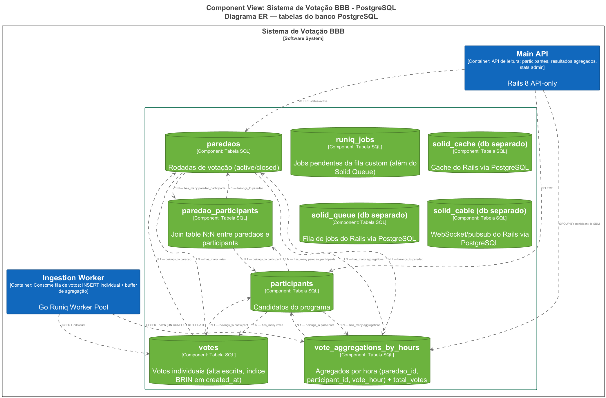
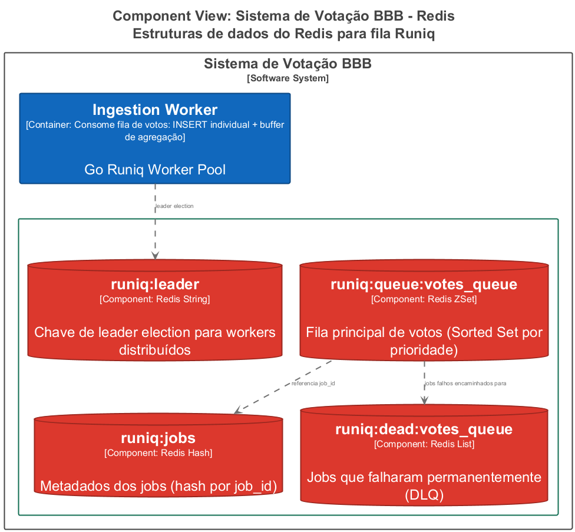
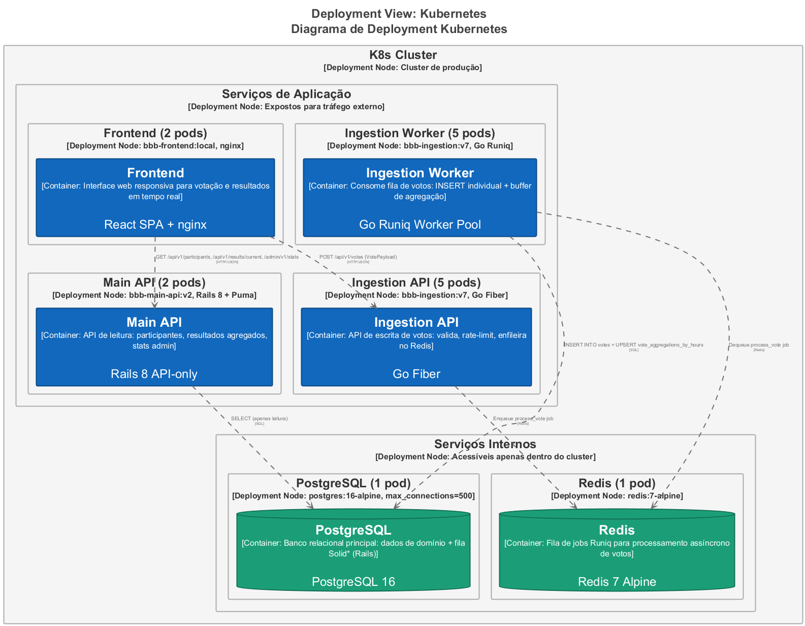

# Arquitetura de Votação

## Índice

- [Arquitetura de Votação](#arquitetura-de-votação)
  - [Índice](#índice)
  - [Nível 1 — Diagrama de Contexto](#nível-1--diagrama-de-contexto)
    - [Atores e Sistemas](#atores-e-sistemas)
    - [Relacionamentos](#relacionamentos)
  - [Nível 2 — Diagrama de Contêineres](#nível-2--diagrama-de-contêineres)
    - [Contêineres](#contêineres)
    - [Protocolos de Comunicação](#protocolos-de-comunicação)
  - [Nível 3 — Diagrama de Componentes](#nível-3--diagrama-de-componentes)
    - [3.1 Frontend](#31-frontend)
      - [API Client (`packages/core/src/api/client.ts`)](#api-client-packagescoresrcapiclientts)
      - [Estrutura Monorepo](#estrutura-monorepo)
    - [3.2 Main API (Rails)](#32-main-api-rails)
      - [Decisão de Design: CQRS](#decisão-de-design-cqrs)
      - [Configuração](#configuração)
    - [3.3 Ingestion API (Go/Fiber)](#33-ingestion-api-gofiber)
      - [Pipeline de Processamento (Write Path)](#pipeline-de-processamento-write-path)
    - [3.4 Ingestion Worker (Go/Runiq)](#34-ingestion-worker-goruniq)
      - [Buffer de Agregação (Aggregation Buffer)](#buffer-de-agregação-aggregation-buffer)
      - [Runiq WorkerPool: Autoscaling](#runiq-workerpool-autoscaling)
  - [Nível 4 — Diagrama de Código](#nível-4--diagrama-de-código)
    - [4.1 PostgreSQL — Modelo ER](#41-postgresql--modelo-er)
      - [Tabelas de Domínio](#tabelas-de-domínio)
      - [Bancos Auxiliares (Solid\*)](#bancos-auxiliares-solid)
    - [4.2 Redis — Estruturas da Fila Runiq](#42-redis--estruturas-da-fila-runiq)
  - [Deployment Kubernetes](#deployment-kubernetes)
    - [Recursos](#recursos)
    - [ConfigMaps](#configmaps)
    - [Segurança (RBAC)](#segurança-rbac)
  - [Fluxos de Dados](#fluxos-de-dados)
    - [6.1 Fluxo de Votação (Write Path)](#61-fluxo-de-votação-write-path)
    - [6.2 Fluxo de Leitura (Read Path)](#62-fluxo-de-leitura-read-path)
    - [6.3 Fluxo de Observabilidade](#63-fluxo-de-observabilidade)
  - [Decisões Arquiteturais](#decisões-arquiteturais)
    - [1. CQRS com duas stacks diferentes](#1-cqrs-com-duas-stacks-diferentes)
    - [2. Buffer de Agregação em Memória](#2-buffer-de-agregação-em-memória)
    - [3. Duas filas de jobs](#3-duas-filas-de-jobs)
    - [4. rastreabilidade Distribuída (Trace ID)](#4-rastreabilidade-distribuída-trace-id)
    - [5. Anti-Bot em Múltiplas Camadas](#5-anti-bot-em-múltiplas-camadas)
    - [6. Stack de Observabilidade Sem Redis Dedicado](#6-stack-de-observabilidade-sem-redis-dedicado)

---

## Nível 1 — Diagrama de Contexto



*Diagrama de Contexto — relacionamentos entre o sistema, o usuário e sistemas externos.*

### Atores e Sistemas

| Elemento | Tipo | Descrição |
|---|---|---|
| **Espectador BBB** | Pessoa | Usuário que assiste ao programa e participa das votações populares |
| **Sistema de Votação BBB** | Sistema de Software | Sistema completo de votação com alta disponibilidade |
| **Google reCAPTCHA** | Sistema Externo | Serviço de verificação anti-bot v3 |
| **Sistema de Monitoramento** | Sistema Externo | Stack de observabilidade: Prometheus, Grafana, Loki, Promtail |

### Relacionamentos

- O **Espectador BBB** acessa o **Sistema de Votação BBB** via HTTPS para votar e acompanhar resultados.
- O **Sistema de Votação BBB** consulta o **Google reCAPTCHA** via HTTPS (`POST /recaptcha/api/siteverify`) para validar tokens anti-bot.
- O **Sistema de Votação BBB** exporta métricas Prometheus e logs via Promtail para o **Sistema de Monitoramento**.

---

## Nível 2 — Diagrama de Contêineres



*Diagrama de Contêineres — visão dos processos, bancos de dados e filas que compõem o sistema.*

### Contêineres

| Contêiner | Tecnologia | Função | Réplicas (K8s) |
|---|---|---|---|
| **Frontend** | React 18 + TypeScript + nginx | Interface web para votação e resultados | 2 |
| **Main API** | Ruby on Rails 8 (API-only) | API de leitura: participantes, resultados, stats admin | 2 |
| **Ingestion API** | Go 1.26 + Fiber v2 | API de escrita: validação, rate-limit, enfileiramento no Redis | 5 |
| **Ingestion Worker** | Go 1.26 + Runiq Engine | Consumo da fila: INSERT + buffer de agregação | 5 |
| **PostgreSQL** | PostgreSQL 16 | Banco relacional principal + Solid Cache/Queue/Cable | 1 |
| **Redis** | Redis 7 Alpine | Fila de jobs Runiq para processamento assíncrono | 1 |

### Protocolos de Comunicação

| Origem | Destino | Protocolo | Descrição |
|---|---|---|---|
| Frontend | Main API | HTTP/JSON | GET reads (participants, results, stats) |
| Frontend | Ingestion API | HTTP/JSON | POST votes (VotePayload) |
| Ingestion API | Google reCAPTCHA | HTTPS | POST /recaptcha/api/siteverify |
| Ingestion API | Redis | Redis Protocol | Enqueue process_vote job |
| Ingestion Worker | Redis | Redis Protocol | Dequeue process_vote job |
| Ingestion Worker | PostgreSQL | SQL/TCP | INSERT votes + UPSERT aggregations |
| Main API | PostgreSQL | SQL/TCP | SELECT (apenas leitura) |
| Monitoramento | Ingestion API | HTTP | Scrape /metrics (Prometheus) |
| Monitoramento | Ingestion Worker | HTTP | Scrape /metrics (Prometheus) |
| Monitoramento | Todos os pods | HTTP | Coleta de logs via Promtail |

---

## Nível 3 — Diagrama de Componentes

### 3.1 Frontend



*Componentes internos do Frontend React.*

| Componente | Arquivo | Descrição |
|---|---|---|
| **App (React)** | `apps/web/src/App.tsx` | Gerenciamento de estado de view via `useState<'voting' \| 'results' \| 'dashboard'>` |
| **ParticipantCard** | `apps/web/src/components/ParticipantCard.tsx` | Card do candidato com ação de voto — executa pipeline anti-bot (fingerprint + reCAPTCHA) antes de chamar `submitVote()` |
| **ResultChart** | `apps/web/src/components/ResultChart.tsx` | Gráfico de barras animado com percentuais — polling a cada 2s via `useResult(2000)` |
| **Dashboard** | `apps/web/src/components/Dashboard.tsx` | Painel administrativo com total de votos, votos por participante e curva horária — polling a cada 5s |
| **@bbb/core (hooks)** | `packages/core/src/hooks/` | Hooks compartilhados: `useParedao()`, `useVote()`, `useResult()` — encapsulam chamadas `fetchRails()` e `fetchGo()` |

#### API Client (`packages/core/src/api/client.ts`)

```typescript
// Dois backends distintos:
const RAILS_API_URL = getEnv('VITE_RAILS_API_URL', 'http://localhost:3001');
const GO_API_URL    = getEnv('VITE_GO_API_URL',    'http://localhost:8080');

// fetchRails: leitura (GET) -> Main API
// fetchGo: escrita (POST) -> Ingestion API
```

#### Estrutura Monorepo

```
frontend/
├── apps/web/        # @bbb/web — React SPA (Vite)
└── packages/core/   # @bbb/core — tipos, API client, hooks (compartilhável)
```

---

### 3.2 Main API (Rails)



*Componentes internos da Main API Rails.*

| Componente | Rota | Descrição |
|---|---|---|
| **ParticipantsController** | `GET /api/v1/participants` | Lista participantes do paredão ativo com `id`, `name`, `avatar_url` |
| **ResultsController** | `GET /api/v1/results/current` | Resultados agregados a partir de `vote_aggregations_by_hours` (NÃO da tabela `votes`) — retorna `{ total_votes, percentages }` |
| **StatsController** | `GET /admin/v1/stats` | Estatísticas administrativas: total de votos, votos por participante, votos por hora (últimas 24h) |
| **Paredao (Model)** | `app/models/paredao.rb` | Rodada de votação com status `active`/`closed` |
| **Participant (Model)** | `app/models/participant.rb` | Candidato do programa |
| **Vote (Model)** | `app/models/vote.rb` | Voto individual (apenas leitura nesta API) |
| **VoteAggregationsByHour (Model)** | `app/models/vote_aggregations_by_hour.rb` | Agregados pré-computados por hora |

#### Decisão de Design: CQRS

A Main API implementa o lado **Query** do padrão CQRS (Command Query Responsibility Segregation):

- **Commands** (escrita) → Ingestion API (Go)
- **Queries** (leitura) → Main API (Rails)

As consultas de resultado NÃO leem da tabela `votes` (que pode ter milhões de linhas), mas sim da tabela `vote_aggregations_by_hours`, que é alimentada pelo Ingestion Worker com dados pré agregados por hora.

#### Configuração

- **CORS:** `origins "*"` (aberto para desenvolvimento)
- **Cache:** Solid Cache (PostgreSQL) em produção, `:memory_store` em desenvolvimento
- **Job Queue:** Solid Queue (PostgreSQL) — para jobs administrativos
- **WebSocket:** Solid Cable (PostgreSQL) — polling interval 0.1s

---

### 3.3 Ingestion API (Go/Fiber)



*Componentes internos da Ingestion API Go.*

| Componente | Arquivo | Descrição |
|---|---|---|
| **Rate Limiter (Middleware)** | `internal/api/router.go` | Limita 10 requisições/s por IP — retorna HTTP 429 em excesso |
| **VoteIngester (Handler)** | `internal/api/ingester.go` | Parseia JSON, gera `trace_id`, valida IDs obrigatórios |
| **RecaptchaVerifier** | `internal/recaptcha/verifier.go` | Verifica token reCAPTCHA v3 via POST ao Google (score >= 0.5); bypass para k6 com `test-bypass-token` |
| **Runiq Enqueuer** | `internal/runiq/client.go` | Enfileira job `process_vote` na fila `votes_queue` do Redis |

#### Pipeline de Processamento (Write Path)

```
POST /api/v1/votes
    │
    ▼
┌──────────────────────┐
│ Rate Limiter         │  ← Fiber middleware, 10 req/s/IP
│ (429 se excedido)    │
└──────┬───────────────┘
       ▼
┌──────────────────────┐
│ VoteIngester         │  ← Parse JSON → vote.Payload
│ - gera/captura       │  ← Gera X-Trace-Id
│   trace_id           │  ← Valida paredao_id ≠ 0, participant_id ≠ 0
│ - valida IDs         │
└──────┬───────────────┘
       ▼
┌──────────────────────┐
│ RecaptchaVerifier    │  ← POST https://www.google.com/recaptcha/api/siteverify
│ (score ≥ 0.5)        │  ← Bypass: "test-bypass-token"
└──────┬───────────────┘
       ▼
┌──────────────────────┐
│ Runiq Enqueuer       │  ← Enqueue("votes_queue", "process_vote", payload)
│                      │  ← Retorna HTTP 202 Accepted (~5ms)
└──────┬───────────────┘
       ▼
      Redis
   (votes_queue)
```

---

### 3.4 Ingestion Worker (Go/Runiq)



*Componentes internos do Ingestion Worker Go.*

| Componente | Arquivo | Descrição |
|---|---|---|
| **VoteJob (Perform)** | `internal/vote/vote_job.go` | Desenfileira e processa: INSERT em `votes` + adiciona ao buffer de agregação |
| **AggregationBuffer** | `internal/vote/aggregation_buffer.go` | Mapa `map[aggKey]int64` protegido por `sync.Mutex` — flush a cada 5s ou 500 chaves |
| **Runiq WorkerPool** | `orkai-runiq/queue/worker.go` | Pool dinâmico de 15-100 workers com leader election |
| **Runiq Dashboard (GUI)** | `orkai-runiq/queue/server.go` | Interface web p/ gerenciamento de jobs (porta 8081) |

#### Buffer de Agregação (Aggregation Buffer)

```go
type AggregationBuffer struct {
    mu     sync.Mutex
    counts map[aggKey]int64  // aggKey = {VoteHour, ParedaoID, ParticipantID}
}

// A cada voto processado:
func (b *AggregationBuffer) Add(paredaoID, participantID int64, voteHour time.Time) {
    b.mu.Lock()
    key := aggKey{voteHour.Truncate(time.Hour), paredaoID, participantID}
    b.counts[key]++
    if len(b.counts) >= 500 { b.Flush() }  // gatilho por tamanho
    b.mu.Unlock()
}

// A cada 5 segundos (ticker):
func (b *AggregationBuffer) Flush() {
    // UPSERT em lote:
    // INSERT INTO vote_aggregations_by_hours (...)
    // VALUES (...)
    // ON CONFLICT (paredao_id, participant_id, vote_hour)
    // DO UPDATE SET total_votes = total_votes + EXCLUDED.total_votes
}
```

**Impacto:** Reduz de milhares de transações/segundo para **1 transação a cada 5 segundos** no PostgreSQL.

#### Runiq WorkerPool: Autoscaling

| Parâmetro | Valor |
|---|---|
| Workers mínimos | 15 |
| Workers máximos | 100 |
| Step up | 10 |
| Step down | 2 |
| Queue depth limit | 20 |
| Leader election | 30s |
| Máx retries | 3 |
| DLQ | runiq:dead:votes_queue |

---

## Nível 4 — Diagrama de Código

### 4.1 PostgreSQL — Modelo ER



*Diagrama entidade-relacionamento das tabelas do banco PostgreSQL.*

#### Tabelas de Domínio

| Tabela | Colunas | Índices | Finalidade |
|---|---|---|---|
| **paredaos** | `id (PK)`, `status (active\|closed)`, `created_at`, `updated_at` | PK em `id` | Rodadas de votação |
| **participants** | `id (PK)`, `name`, `avatar_url`, `created_at`, `updated_at` | PK em `id` | Candidatos |
| **paredao_participants** | `id (PK)`, `paredao_id (FK)`, `participant_id (FK)`, `created_at`, `updated_at` | UNIQUE(paredao_id, participant_id) | Join table N:N |
| **votes** | `id (PK)`, `paredao_id (FK)`, `participant_id (FK)`, `fingerprint_id`, `created_at` | BRIN(created_at) | Votos individuais (alta escrita) |
| **vote_aggregations_by_hours** | `paredao_id`, `participant_id`, `vote_hour`, `total_votes` | PK composta (paredao_id, participant_id, vote_hour) | Agregados por hora |
| **runiq_jobs** | `id (PK)`, `queue_name`, `job_type`, `payload`, `status`, `attempts`, `run_at`, `locked_at`, `created_at`, `updated_at` | Partial UNIQUE(queue_name, status, run_at) WHERE status=pending | Fila de jobs custom |

#### Bancos Auxiliares (Solid*)

| Banco | Tecnologia | Finalidade |
|---|---|---|
| `backend_production_cache` | Solid Cache (PostgreSQL) | Cache do Rails |
| `backend_production_queue` | Solid Queue (PostgreSQL) | Job queue do Rails |
| `backend_production_cable` | Solid Cable (PostgreSQL) | WebSocket/pubsub do Rails |

### 4.2 Redis — Estruturas da Fila Runiq



*Estruturas de dados do Redis utilizadas pelo Runiq.*

| Chave Redis | Tipo | Finalidade |
|---|---|---|
| `runiq:queue:votes_queue` | ZSet (Sorted Set) | Fila principal de votos, ordenada por prioridade |
| `runiq:jobs` | Hash | Metadados dos jobs indexados por `job_id` |
| `runiq:queues` | Set | Conjunto de todos os nomes de filas |
| `runiq:scheduled:votes_queue` | ZSet | Jobs com execução futura agendada |
| `runiq:active:votes_queue` | Set | Jobs atualmente em processamento |
| `runiq:processed:votes_queue` | List | Histórico de IDs de jobs processados |
| `runiq:dead:votes_queue` | List | Jobs que falharam permanentemente (DLQ) |
| `runiq:errors` | Hash | Mensagens de erro indexadas por `job_id` |
| `runiq:leader` | String | Chave de leader election (TTL renovável) |
| `runiq:unique:votes_queue:{key}` | String | Locks de deduplicação de jobs |

---

## Deployment Kubernetes



*Diagrama de Deployment — distribuição dos contêineres no cluster Kubernetes.*

### Recursos

| Recurso | Tipo | Imagem | Réplicas | Porta |
|---|---|---|---|---|
| **redis** | Deployment | `redis:7-alpine` | 1 | 6379 (ClusterIP) |
| **postgres** | Deployment | `postgres:16-alpine` (args: `-c max_connections=500`) | 1 | 5432 (ClusterIP) |
| **main-api** | Deployment | `bbb-main-api:v2` (Rails 8 + Puma + Thruster) | 2 | 80 → LoadBalancer:3001 |
| **frontend** | Deployment | `bbb-frontend:local` (nginx) | 2 | 80 → LoadBalancer:3000 |
| **ingestion-api** | Deployment | `bbb-ingestion:v7` (Go Fiber) | 5 | 8080 → LoadBalancer:8080 (NodePort:30080) |
| **ingestion-worker** | Deployment | `bbb-ingestion:v7` (Go Runiq) | 5 | 8081 → LoadBalancer:8082 |
| **prometheus** | Deployment | `prom/prometheus:v2.51.1` | 1 | 9090 (ClusterIP) |
| **grafana** | Deployment | `grafana/grafana:11.4.0` | 1 | 3000 → LoadBalancer:3003 |
| **loki** | Deployment | `grafana/loki:3.3.2` | 1 | 3100 (ClusterIP) |
| **promtail** | DaemonSet | `grafana/promtail:3.3.2` | 1/node | 9080 (ClusterIP) |
| **k6-heavy-test** | Job | `grafana/k6:latest` | 1 | — |

### ConfigMaps

| ConfigMap | Conteúdo |
|---|---|
| `prometheus-config` | Scrape interval 2s, `kubernetes_sd_configs` com relabeling para `ingestion-api` e `ingestion-worker` |
| `grafana-dashboards` | 3 dashboards provisionados: SLI Performance, Runiq Dashboard, Business |
| `grafana-datasources` | Prometheus (default) + Loki |
| `k6-test-script` | Script `load_test_7k.js` (7.500 req/s constantes) |
| `loki-config` | Schema v13, TSDB, chunk idle 5min |
| `promtail-config` | Scrape de pods com labels `ingestion-api\|ingestion-worker`, parse CRI + JSON |

### Segurança (RBAC)

| ServiceAccount | ClusterRole | Permissões |
|---|---|---|
| `prometheus` | `prometheus` | get/list/watch em nodes, services, endpoints, pods, ingresses; acesso a `/metrics` |
| `promtail` | `promtail` | get/list/watch em nodes, pods, namespaces |

> **Nota:** Não há recursos Secret do Kubernetes. Senhas (Postgres, Grafana, Rails SECRET_KEY_BASE, RECAPTCHA_SECRET_KEY) são passadas como literais em `env` dos deployments.

---

## Fluxos de Dados

### 6.1 Fluxo de Votação (Write Path)

```
Espectador (Browser)
    │
    ├─[1]─► Frontend: ParticipanteCard
    │        ├─ Gera fingerprint_id (canvas fingerprinting → localStorage)
    │        ├─ Obtém recaptcha_token (Google reCAPTCHA v3 invisível)
    │        └─ Chama submitVote({ paredao_id, participant_id, fingerprint_id, recaptcha_token })
    │
    ├─[2]─► Ingestion API (POST /api/v1/votes)
    │        ├─ Rate Limiter (10 req/s/IP)
    │        ├─ Parse + valida payload
    │        ├─ RecaptchaVerifier (POST → Google, score ≥ 0.5)
    │        ├─ Gera trace_id
    │        └─ Runiq Enqueuer → Redis (votes_queue)
    │
    └─[3]─► Ingestion Worker (Runiq WorkerPool 15-100)
               ├─ Dequeue → VoteJob.Perform()
               ├─ INSERT individual em `votes`
               ├─ AggregationBuffer.Add() → map[aggKey]++
               └─ Flush a cada 5s ou 500 keys:
                    UPSERT INTO vote_aggregations_by_hours
```

**Tempo de resposta ao usuário:** ~5ms (até o `202 Accepted`).

### 6.2 Fluxo de Leitura (Read Path)

```
┌─ Votação ─────────────────────────────┐
│ Espectador → Frontend → Main API      │
│              GET /api/v1/participants  │  ← Lista participantes
│              GET /api/v1/results/current│ ← Polling 2s (ResultChart)
└────────────────────────────────────────┘

┌─ Dashboard ────────────────────────────┐
│ Produção → Frontend → Main API         │
│              GET /admin/v1/stats       │ ← Polling 5s (Dashboard)
└────────────────────────────────────────┘
```

### 6.3 Fluxo de Observabilidade

```
┌─ Métricas ─────────────────────────────┐
│ Ingestion API (:8080/metrics)          │
│ Ingestion Worker (:8081/metrics)       │
│      │                                  │
│      ▼                                  │
│ Prometheus (scrape 2s)                  │
│      │                                  │
│      ▼                                  │
│ Grafana (3 dashboards provisionados)    │
│  ├─ SLI Performance (QPS, latência P95, │
│  │   erro 5xx/429, goroutines/heap)     │
│  ├─ Runiq Dashboard (fila pending,      │
│  │   active, dead, processed, throughput)│
│  └─ Business (total votos ingeridos,    │
│       total votos processados)           │
└─────────────────────────────────────────┘

┌─ Logs ─────────────────────────────────┐
│ Todos os pods → STDOUT (JSON)           │
│      │                                  │
│      ▼                                  │
│ Promtail (DaemonSet)                    │
│  ├─ Parse CRI + JSON                    │
│  ├─ Extrai campos: level, msg, trace_id │
│  └─ Envia para Loki                     │
│      │                                  │
│      ▼                                  │
│ Grafana → Datasource Loki               │
│  └─ Consulta por trace_id               │
└─────────────────────────────────────────┘
```

---

## Decisões Arquiteturais

### 1. CQRS com duas stacks diferentes

| Característica | Command (Escrita) | Query (Leitura) |
|---|---|---|
| **Stack** | Go + Fiber | Ruby on Rails 8 |
| **Responsabilidade** | Ingerir votos com alta vazão | Servir dados consistentes |
| **Banco** | Escreve em `votes` e `vote_aggregations_by_hours` | Lê de `vote_aggregations_by_hours` |
| **Padrão** | Event Sourcing (fila) | Materialized View (tabela agregada) |
| **Escalabilidade** | 5 pods (horizontal) | 2 pods (horizontal) |
| **Réplicas K8s** | 5 cada (API + Worker) | 2 |

### 2. Buffer de Agregação em Memória

- **Problema:** Com base nos testes precisaria escalar muito os pods para aguentar mais que 7.500.. 8.000 INSERTs/s no PostgreSQL, volumes maiores causariam contenção de I/O.
- **Solução:** Buffer thread-safe em Go que acumula votos em RAM e faz UPSERT em lote a cada 5s ou 500..1000 chaves.
- **Resultado:** 1 transação/5s no lugar de milhares/segundo.

### 3. Duas filas de jobs

| Fila | Engine | Finalidade |
|---|---|---|
| `votes_queue` (Redis) | Runiq (Go) | Fila principal de alta vazão para votos |
| Solid Queue (PostgreSQL) | Rails Active Job | Jobs administrativos do Rails (e.g., limpeza de jobs finalizados) |

### 4. rastreabilidade Distribuída (Trace ID)

Cada voto recebe um `X-Trace-Id` que flui por todo o pipeline:

```
Ingestion API → Redis (runiq:jobs) → Ingestion Worker → slog JSON → Promtail → Loki
```

Isso permite debugar falhas específicas (ex: FK violation) rastreando o voto desde a origem até o erro.

### 5. Anti-Bot em Múltiplas Camadas

| Camada | Mecanismo |
|---|---|
| **Browser** | Canvas fingerprint → `fingerprint_id` armazenado em localStorage |
| **Browser** | Google reCAPTCHA v3 (invisível) → token |
| **Ingestion API** | Rate Limiter (10 req/s/IP) |
| **Ingestion API** | Verificação do score reCAPTCHA (≥ 0.5) |
| **Worker** | Unique job locks (Redis) — evita processamento duplicado |

### 6. Stack de Observabilidade Sem Redis Dedicado

- **Cache:** Solid Cache (PostgreSQL)
- **Job Queue (Rails):** Solid Queue (PostgreSQL)
- **WebSocket:** Solid Cable (PostgreSQL)
- **Job Queue (Go):** Runiq (Redis)

Único Redis é messageria de alta vazão dos votos.
